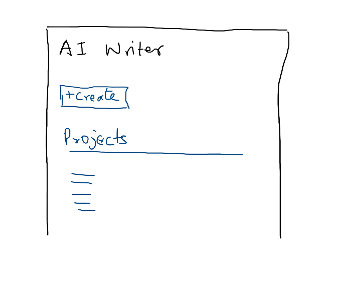
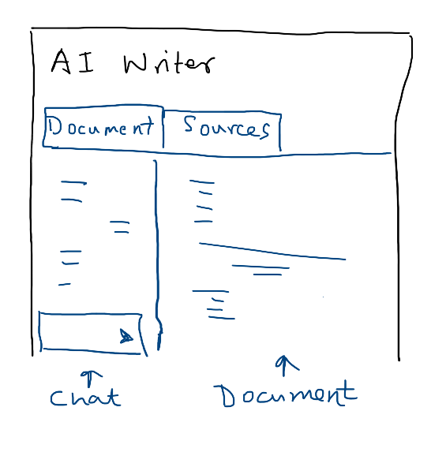
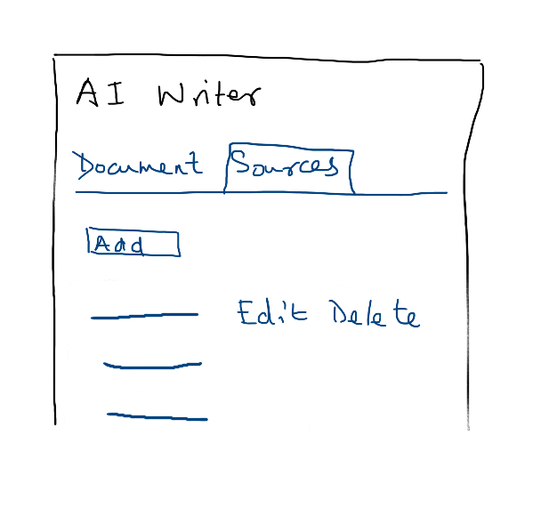

# AI Writer App

This application is a tool to help writers to research and edit their content.

## Terms

- **Project**: A project is a writing project that the writer is working on. Example: If I am writing an article about "how to build AI application", then that is a project
- **Sources**: Sources are the various places where the writer is getting information from
    - Text Source: The writer can paste some text content that they have found somewhere
    - Web Search: The writer can enter a topic or a search term. The application will search the web to collect information on that topic, summarise the answer and store the answer as a source for later reference
    - Audio: The writer can upload an mp3 file containing a conversation. The application will transcribe (convert speech to text) of the mp3 file and store the text as a source for later reference

## Application flow

When the user starts the application, they will see the main screen. This screen will show the recent projects, plus allow them to create a new project.

When the user clicks into a project, they will come to a screen where they will see a tab bar on top with two choices:

- Document
- Sources

Initially the screen will be in the Document tab

### Document Tab

The Document tab is where the writer will create the article.

This part is vertically split into two:

- The left one-third is the chat interface
- The right is the document

In the chat, the user can give a command to the AI, example: "Generate an introduction and put it at the top" or "Rewrite paragraph 2 and make it shorter with simple language"

The AI will then perform the change to the document based on the information in the Sources. Any changes to the document will be shown on the right side

The user can also ask questions, like "When was Python created?". The AI will use the Sources as reference and answer the question. This answer will be within the chat interface itself (not changing the document)

Apart from using the chat interface, the user can also manually edit the content directly.

They can also save the current version of the document here.

### Sources

In this tab, there will be a button to create a source on the top and a table below.

The table will show the available sources and the actions: edit or delete

Clicking edit will go to a screen where the source will be shown along with the text content of the source

Here the writer can view the contents of the source and manually make edits and save the source, or cancel and go back without saving.

Deleting the source will remove it from the list. The AI in the chat interface will no longer use that source when making changes or answering questions.

## Notes

- Documents are only text. There is no formatting (heading, bold, italics etc) or images that is supported as of now
